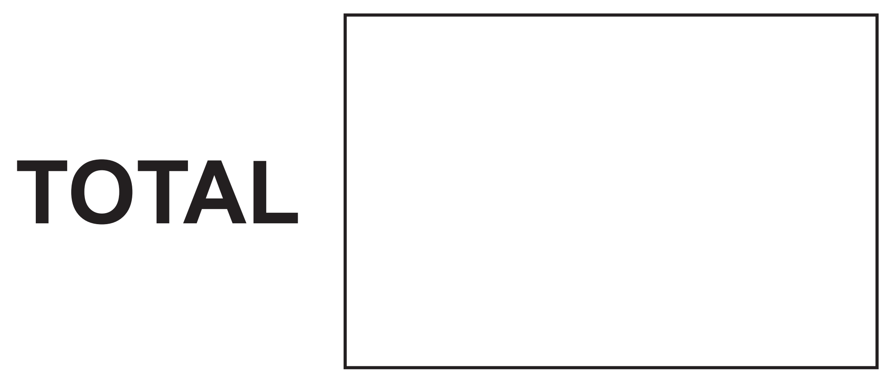
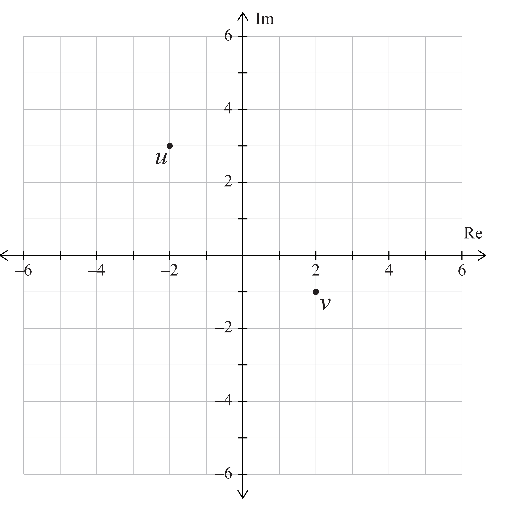

SUPERVISOR'S USE ONLY

MANA TOHU MATAURANGA O /

Level 3 Calculus, 2013

# 91577  Apply The Algebra Of Complex Numbers In Solving Problems

9.30 am Wednesday 13 November 2013 Credits: Five

| Achievement                          | Achievement with Merit                | Achievement with Excellence           |
|--------------------------------------|---------------------------------------|---------------------------------------|
| Apply the algebra of complex numbers | Apply the algebra of complex numbers, | Apply the algebra of complex numbers, |
| in solving problems.                 | using relational thinking, in solving | using extended abstract thinking, in  |
|                                      | problems.                             | solving problems.                     |

Check that the National Student Number (NSN) on your admission slip is the same as the number at the top of this page.

You should attempt ALL the questions in this booklet.

Show ALL working.

Make sure that you have the Formulae and Tables Booklet L3-CALCF.

If you need more space for any answer, use the page(s) provided at the back of this booklet and clearly number the question.

Check that this booklet has pages 2–10 in the correct order and that none of these pages is blank.

YOU MUST HAND THIS BOOKLET TO THE SUPERVISOR AT THE END OF THE EXAMINATION.

91577 ASSESSOR'S USE ONLY
© New Zealand Qualifications Authority, 2013. All rights reserved.

No part of this publication may be reproduced by any means without the prior permission of the New Zealand Qualfications Authority ASSESSOR'S
USE ONLY
You are advised to spend 60 minutes answering the questions in this booklet.

#### Question One

$$\left(a\right)$$

 4 = in the form a + b√5, where a and b are rational numbers.
2 = √5 Write
(b)
Complex numbers u and v are represented on the Argand diagram.

If w =  u - v, then show w on the Argand diagram below.

2
(c)
One root of the equation  z3 - 3z + p = 0  is  z = 2 - 3i.

ASSESSOR'S
 USE ONLY
If p is a real number, find the value of p and the other roots of the equation.

(d)
If   z = 1 + i  and w = = + i,  find the exact value of arg(w).

3
(e)
If u = 6 + ki and  v = 4 + ki, find k  if  arg(u.v) = = -
ASSESSOR'S 
 USE ONLY
4 ASSESSOR'S
What is the remainder when  x3 + 4x2 + 3x - 9 is divided by  x + 2?

(a)
(b)
If u = 2 cis =  and  v = 6 cis = , write = in polar form.

(c)
Find the equation whose roots are three times those of  x2 + 9x - 12 = 0.

## Question Two

5 If u = x + i y and  au2 + bu + c = 0, prove that aū2 + bū + c = 0.

(d)
ASSESSOR'S
   USE ONLY
 ଚି
Describe fully the locus of the points representing  z   if 
(e)
ASSESSOR'S 
USE ONLY
7

## Question Three

USE ONLY
(a)
Solve the equation  z2 + 6z + 20 = 0.

Express the solutions in the form  z = a + √bi,  where a and b are integers.

(b)
p and q are complex numbers, where  p = 3 + 4i  and  q = 2 - 3i.

Find pq, expressing your answer in the rectangular form  α + bi.

(c)
Solve the following equation for x in terms of p:
√x -3=√x - p 8 ASSESSOR'S
 USE ONLY
Find all the solutions of the equation  z3 + n = 0, where n is a positive real number.

(d)
Write your solutions in polar form as expressions in terms of n.

(e)
Find the values of k for which the equation 6+x−4√3x+k =0 has no real roots.

9 QUESTION
 NUMBER
Extra paper if required.

Write the question number(s) if applicable.

ASSESSOR'S
 USE ONLY
10 9157 L